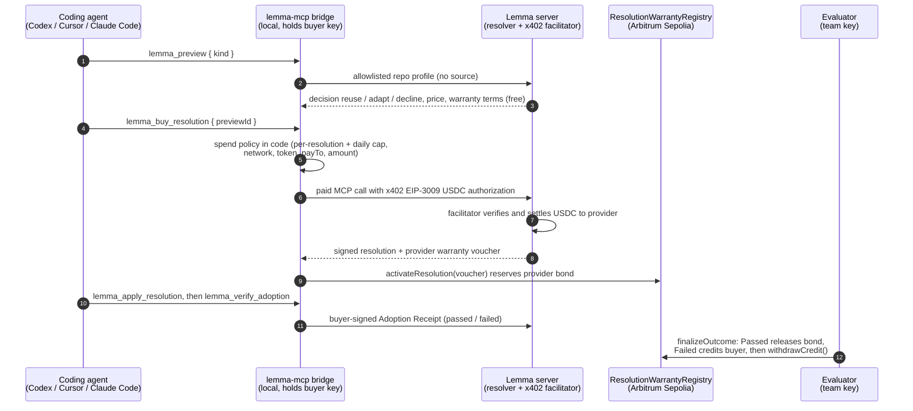

# Lemma

**Bonded compatibility resolutions for coding agents, paid with x402 on Arbitrum.**

Lemma lets a coding agent ask, before it writes any code, whether verified prior integration work already fits the repository in front of it. The preview is free. If a curated Capability Release fits, a local MCP bridge pays a few cents of USDC through x402, receives a provider-signed resolution (a patch bundle plus a pinned acceptance test), applies it, and runs the test. Every paid resolution reserves provider bond in a warranty registry on Arbitrum Sepolia. If an evaluator confirms that the adoption failed, the buyer is refunded from that bond. Lemma sells verified applicability and a ready integration path. It does not sell ownership of open-source code.

> **Status: working testnet MVP.** The contract is deployed on Arbitrum Sepolia, both releases are registered and bonded, and the full product flow runs end to end on a fork with `npm run demo:fork`. The full flow has also run live on Arbitrum Sepolia: [live x402 settlement](https://sepolia.arbiscan.io/tx/0x38e6c25b7b690e61d6de9a3ab533d7a08d71f2e0f62bdf26ae35d887d4a4f869), warranty activation, evaluator outcomes and a [bond refund](https://sepolia.arbiscan.io/tx/0x4ce2d7730211aa1e37604ed5adccc9803a35ec487379eed61c87887fed9bc1ce) (`npm run demo:testnet -- --yes`). The paired 20-run benchmark measured 74.9% fewer tokens but missed the all-in cost target, so Lemma makes **no savings claim**. See [Status and limitations](#status-trust-assumptions-and-limitations).

## The problem

Coding agents keep re-solving the same integration tasks. Adding x402 payments to an MCP server, or writing a paying MCP client with spending limits, is solved work: the code is open source. But an agent still has to research it, adapt it to the repository's pinned dependencies, debug it, and get tests green. That costs tokens, time, and retries on every repository.

Open source makes code available. It does not tell the agent whether a given implementation fits this repository, whether it still works with these versions, or whether adapting it is cheaper than rebuilding. When something prepackaged fails, the buyer usually has no recourse.

Lemma sells that missing piece: a context-bound compatibility decision, a deterministic patch, a pinned acceptance test, and bonded recourse if it fails.

## How it works



In plain text: **agent → local bridge → Lemma server → x402 settlement (USDC to provider) → warranty registry on Arbitrum**.

1. **Free preview.** The bridge reads only allowlisted manifest and lockfile metadata, never source, and sends a typed profile. A deterministic resolver returns `reuse`, `adapt`, or `decline`. A decline carries no price and no payment offer.
2. **Local spend policy.** Before anything is signed, bridge code checks the per-resolution cap (default 0.25 USDC), the daily cap (default 1.00 USDC), the network, the token, the recipient, and that the amount equals the previewed price. The model cannot raise these limits.
3. **x402 payment.** The bridge pays through the standard x402 `exact` scheme (EIP-3009 USDC) to Lemma's self-hosted facilitator on Arbitrum Sepolia.
4. **Signed delivery.** The server returns the resolution and an EIP-712 warranty voucher whose `paymentHash` is the real settlement transaction. The bridge checks the payload digest and the voucher signer. If the paid response is lost, the bridge recovers it by ID and never pays twice.
5. **Warranty.** The bridge activates the voucher on chain, which reserves provider bond equal to the price for a 72-hour claim window.
6. **Adoption.** The patch is previewed (dry run by default), applied atomically, and verified with the release's pinned acceptance test. The buyer signs an Adoption Receipt.
7. **Outcome.** The evaluator signs `Passed` (the bond reservation is released) or `Failed` (the buyer gets withdrawable credit from the bond). Unresolved warranties expire after the claim window.

More detail: [docs/architecture.md](docs/architecture.md), [docs/interfaces.md](docs/interfaces.md), [docs/economics.md](docs/economics.md).

## Live deployment

| | |
|---|---|
| Network | Arbitrum Sepolia (chain ID `421614`) |
| Warranty registry | [`0x45Ae8799dF4C0878AD22CFe7040383F25f046d56`](https://sepolia.arbiscan.io/address/0x45Ae8799dF4C0878AD22CFe7040383F25f046d56) |
| Deploy transaction | [`0xa015c0cc…5173cc42`](https://sepolia.arbiscan.io/tx/0xa015c0cc368327f674f4f0954816b6ccc6154a384d73c61ae41ab0105173cc42) |
| USDC (Arbitrum Sepolia) | [`0x75faf114eafb1BDbe2F0316DF893fd58CE46AA4d`](https://sepolia.arbiscan.io/address/0x75faf114eafb1BDbe2F0316DF893fd58CE46AA4d) |
| Provider (x402 `payTo`, voucher signer) | [`0xA9361c7A43b65933EAFdCEf63CfC07449C38AcB1`](https://sepolia.arbiscan.io/address/0xA9361c7A43b65933EAFdCEf63CfC07449C38AcB1) |
| Facilitator | [`0xeD09e99F20cEEd22BFff0D465f5A61d061b36e05`](https://sepolia.arbiscan.io/address/0xeD09e99F20cEEd22BFff0D465f5A61d061b36e05) |
| Evaluator | [`0xd059A60Cf6Cc3fD83002389f2128cFB6F1c70a77`](https://sepolia.arbiscan.io/address/0xd059A60Cf6Cc3fD83002389f2128cFB6F1c70a77) |
| Hosted server and dashboard | https://lemma-production-8383.up.railway.app |
| Live demo purchase | [live x402 settlement](https://sepolia.arbiscan.io/tx/0x38e6c25b7b690e61d6de9a3ab533d7a08d71f2e0f62bdf26ae35d887d4a4f869) · [bond refund](https://sepolia.arbiscan.io/tx/0x4ce2d7730211aa1e37604ed5adccc9803a35ec487379eed61c87887fed9bc1ce) |

Registered releases, each priced at 0.12 USDC with a 72-hour claim window and bonded with 1 USDC:

| Release | On-chain `releaseId` | Registration tx |
|---|---|---|
| `x402-mcp-server@1.0.0`: x402 payment gating for a TypeScript MCP server | `0x62bba684a1de6151831106c327faa33f272c0421ab9276ef67921acb227c6edf` | [`0x7d229105…5bef6b`](https://sepolia.arbiscan.io/tx/0x7d2291055665968ea15984a79202e9f8052cb1dee9f5dde194f51369985bef6b) |
| `x402-mcp-client@1.0.0`: x402-paying MCP client with spend limits | `0x01efd47d351906ba16367c07164dd008e4c554f3e878c227aa8c3018611e3ac4` | [`0xbca22fad…1e3ac4`](https://sepolia.arbiscan.io/tx/0xbca22faddefbfd5b1e86e86e726d795f5647283fe7ddbb2d33152fdc6fb6998a) |

The machine-readable record, including bond transactions, the EIP-712 domain separator, the compiler settings, and the source commit, is in [`contracts/deployments/421614.json`](contracts/deployments/421614.json).

## Quickstart

### Requirements

- Node.js 22 or newer and npm 10 or newer
- [Foundry](https://book.getfoundry.sh/) (`forge`, `anvil`) on `PATH`
- Optional: PostgreSQL 16 binaries for the demo database (it falls back to in-memory storage without them)

### Install

```bash
git clone https://github.com/tyler-turnpike/Lemma.git && cd Lemma
git submodule update --init --recursive
npm ci
```

### See the whole product with zero secrets

```bash
npm run demo:fork
```

This takes about 20 seconds and needs no keys, no `.env`, and no funds. It forks Arbitrum Sepolia with Anvil (real USDC bytecode) and uses only Anvil's public dev keys. It then:

- deploys the registry, registers and bonds both releases,
- starts the production server entry with its self-hosted x402 facilitator,
- drives the real `lemma-mcp` bridge over stdio, the same way a coding agent does,
- runs a free preview, a capped x402 purchase with real settlement, warranty activation, patch apply, acceptance test, signed receipt, and evaluator `Passed`,
- shows free `decline` decisions on a Python repository and an Express repository with no MCP server (0 USDC spent),
- runs a clearly labelled **prepared failure**: a dropped paid response is recovered without a second payment, the evaluator signs `Failed`, and the buyer withdraws 0.12 USDC from the provider bond,
- advances chain time 72 hours and expires an unresolved warranty.

It prints a numbered narrative with balances and transaction hashes and ends with `DEMO PASSED`. Use `npm run demo:fork -- --memory` to skip Postgres, or `-- --keep` to keep logs and workspaces.

The live-network version (`npm run demo:testnet -- --yes`) needs funded testnet role keys. See [docs/deployment.md](docs/deployment.md).

### Connect the bridge to your coding agent

```bash
npm run build -w @lemma/bridge     # produces apps/bridge/dist/index.js (the lemma-mcp bin)
```

Claude Code example:

```bash
claude mcp add lemma \
  -e LEMMA_API_URL=https://lemma-production-8383.up.railway.app \
  -e LEMMA_WORKSPACE="$PWD" \
  -e BUYER_PRIVATE_KEY=0x... \
  -e LEMMA_PROVIDER_ADDRESS=0xA9361c7A43b65933EAFdCEf63CfC07449C38AcB1 \
  -e RESOLUTION_WARRANTY_REGISTRY_ADDRESS=0x45Ae8799dF4C0878AD22CFe7040383F25f046d56 \
  -e ARBITRUM_SEPOLIA_RPC_URL=https://sepolia-rollup.arbitrum.io/rpc \
  -- node /absolute/path/to/Lemma/apps/bridge/dist/index.js
```

Use a throwaway testnet wallet as the buyer. Codex (`~/.codex/config.toml`) and Cursor (`.cursor/mcp.json`) configurations, every environment variable, and the purchase safety rules are in [apps/bridge/README.md](apps/bridge/README.md). The buyer key lives only in the MCP server's environment block. The model never sees it.

The bridge exposes four tools: `lemma_preview`, `lemma_buy_resolution`, `lemma_apply_resolution` (dry run unless `apply: true`), and `lemma_verify_adoption`.

## Repository map

```text
apps/
  bridge/      lemma-mcp: local stdio MCP server. Buyer wallet, spend policy, x402 client,
               payload verification, warranty activation, patch apply, acceptance, receipts
  server/      Hono server: remote MCP (free preview + x402-paid purchase + recovery),
               self-hosted x402 facilitator, deterministic resolver, Postgres, read-only API
  web/         React + Vite landing page and dashboard (catalog, resolutions, benchmark, status)
packages/
  core/        Strict Zod schemas, RFC 8785 canonical hashing, EIP-712 types, spend policy,
               safe bundle apply and acceptance runner
  catalog/     Two curated Capability Releases, payloads, fixtures (exact, boundary, negative)
  benchmark/   Codex SDK harness for the paired control vs. Lemma experiment
contracts/     Foundry: ResolutionWarrantyRegistry (bond, vouchers, outcomes, credits) + scripts
scripts/       demo:fork, demo:testnet, testnet:setup, evaluator CLI
docs/          Architecture, interfaces, economics, security model, benchmark protocol,
               deployment runbook, demo script, submission and video scripts
ops/           Dockerfile and Railway config (one replica serving API + dashboard)
```

## Verify

```bash
npm run typecheck        # all TypeScript project references
npm test                 # 282 Vitest tests across core, catalog, server, bridge, web, benchmark
npm run contracts:test   # 73 Foundry tests: unit, fuzz, invariant, EIP-712 vectors
npm run demo:fork        # full product flow on an Arbitrum Sepolia fork, ends with DEMO PASSED
```

Tests need no environment variables. TypeScript and Solidity share fixed EIP-712 test vectors ([contracts/test/vectors.md](contracts/test/vectors.md)), so a digest mismatch between bridge, server, and contract fails the tests.

## Status, trust assumptions, and limitations

**Built and working**

- `ResolutionWarrantyRegistry` deployed on Arbitrum Sepolia. Both releases are registered and bonded with 1 USDC each.
- Remote MCP server with x402-gated purchase, a self-hosted facilitator, idempotent recovery, Postgres persistence, and a read-only API.
- Local `lemma-mcp` bridge with code-enforced spend limits, payload and voucher verification, on-chain warranty activation, atomic patch apply, and signed receipts.
- Dashboard pages for the catalog, resolution records, benchmark status, and system status.
- End-to-end product flow verified on a fork (`npm run demo:fork`), including real x402 settlement, a bond refund, free no-match, lost-response recovery, and expiry.

**In progress**

- Live testnet purchase run: [live x402 settlement](https://sepolia.arbiscan.io/tx/0x38e6c25b7b690e61d6de9a3ab533d7a08d71f2e0f62bdf26ae35d887d4a4f869).
- Hosted deployment: https://lemma-production-8383.up.railway.app.
- Full 20-run benchmark matrix (see below).

**Trust assumptions (read these)**

- **Testnet only.** Everything runs on Arbitrum Sepolia with test USDC. No real money moves, and testnet payments are not revenue.
- **The evaluator is a trusted, team-operated key.** It is a separate key from the provider, but it is not decentralized arbitration. Lemma is not a correctness oracle. It demonstrates an economic mechanism (bonded recourse after payment), not trustless proof that software works.
- **One first-party provider.** The server, the provider, and both releases are run by the team. This is a curated catalog of two releases, not a marketplace.
- **Provisional evidence.** Both releases are marked `provisional` because the benchmark has not run. The demo server runs with `LEMMA_ALLOW_PROVISIONAL=true` so they can be purchased, and every preview says so.
- **Receipts are not proof of savings.** Adoption Receipts record outcomes. Only the paired benchmark can show causal savings.

**Known limitations**

- Narrow scope: TypeScript MCP projects and two x402 integration tasks. Everything else gets a free `decline`.
- Settlement timeouts are not reconciled automatically. The facilitator runs as a single replica with in-process locks.
- No chain-event indexer yet. The dashboard links to Arbiscan for warranty activation and claims.
- The contract is unaudited and not formally verified. Contract signers (ERC-1271) are not supported.
- The step-10 failure in the demo is staged and labelled `PREPARED FAILURE`. It shows the refund path, not an organic failure.

## Benchmark

**Question:** does Lemma lower all-in cost-to-green on supported integration tasks without lowering correctness?

**Protocol** ([docs/benchmark-protocol.md](docs/benchmark-protocol.md)): OpenAI Codex SDK 0.160.0 with the frozen model `gpt-5.6-luna` (reasoning effort medium). Three matched tasks (x402 paywall on an MCP server, x402-paying MCP client, and a boundary server profile that needs adaptation) plus one no-match Express task. Each runs in a control arm and a Lemma arm, three repetitions per matched task per arm, for 20 runs total. Both arms get identical fixtures, prompts, acceptance tests, sandbox, time budget, and research channel. The treatment arm additionally gets the Lemma rule and the bridge. Every run is kept, including failures.

**Success criteria:** treatment median all-in cost and median total tokens are each at least 25 percent lower, no pass-rate regression on any task, and 0 USDC spent on the no-match task.

**Result (2026-10-02, 20/20 runs, verdict: not validated).**

| Matched tasks, medians | Control | Lemma |
|---|---|---|
| Total tokens | 963,971 | 242,443 (**74.9% fewer**) |
| Raw model cost (estimate) | $0.0336 | $0.0115 (about 66% lower) |
| All-in cost, incl. 0.12 USDC price | $0.0336 | $0.1306 (**288.3% higher**) |
| Duration | 95.9 s | 42.4 s |
| Acceptance pass rate | 8/9 | 9/9 |

The no-match task spent 0 USDC in the Lemma arm. **The pre-registered 25% all-in cost target was missed, so Lemma claims no savings.** On a model this cheap (about $0.03 per control run), the fixed 0.12 USDC price is about four times the model cost it saves; the price would need to be under roughly $0.022 to break even at these numbers. Token and time reductions are real measurements, not a cost claim. Disclosed limitations: one Lemma run's purchase never settled (no USDC moved) and the agent solved the task unaided; inside the sandbox, vitest often could not create its temp directory, which likely inflated control-arm tokens. Aggregate: [`packages/benchmark/published/aggregate.json`](packages/benchmark/published/aggregate.json), also on the [/benchmark](https://lemma-production-8383.up.railway.app/benchmark) page.

```bash
npm run benchmark -- --plan            # print the frozen 20-run matrix (no API calls)
npm run benchmark -- --run --confirm   # run it (needs OPENAI_API_KEY and a funded benchmark buyer)
npm run benchmark -- --report          # aggregate -> GET /api/v1/benchmarks
```

## Security notes

- **Keys stay local and role-separated.** Buyer, provider, facilitator, evaluator, and deployer are distinct keys. The buyer key lives only in the bridge process. The server never holds the deployer or evaluator key. The browser holds none.
- **Prompt injection cannot spend.** Payment permission never comes from model text. The spend policy is checked in code and wired into the x402 client's approval hooks. The bridge pays only the previewed amount to the configured provider in Arbitrum Sepolia USDC, and at most once per buy call.
- **No source upload.** Profiles are built from allowlisted manifest and lockfile names only.
- **Safe patching.** Paths are confined to the workspace, symlinks are rejected, base-file drift aborts the apply, writes are staged with rollback, and dry run is the default. Acceptance commands are reviewed argv arrays, spawned without a shell, with an allowlisted environment and limits.
- **Signed and replay-protected.** EIP-712 vouchers bind chain, contract, buyer, release, payload digest, amount, payment hash, and expiry. The registry rejects reused resolution IDs and payment hashes. Reserved bond cannot be withdrawn, and credits are pull-based behind a reentrancy guard.
- **Fail closed.** Unknown fields on signed payloads are rejected, rejected payloads are quarantined and never applied, and logs are scrubbed of secrets.

Full model: [docs/security-model.md](docs/security-model.md) and [SECURITY.md](SECURITY.md). This is unaudited hackathon software. Use throwaway testnet wallets only.

## Documentation

- [docs/architecture.md](docs/architecture.md): components, trust boundaries, data flow
- [docs/interfaces.md](docs/interfaces.md): bridge and server MCP contract, read-only API
- [docs/economics.md](docs/economics.md): what is sold, pricing rule, warranty incentives
- [docs/security-model.md](docs/security-model.md): threats, controls, accepted MVP trust
- [docs/benchmark-protocol.md](docs/benchmark-protocol.md): frozen paired experiment
- [docs/deployment.md](docs/deployment.md): testnet runbook and operator scripts
- [docs/demo-script.md](docs/demo-script.md): demo sequence, and claims to make and avoid
- [docs/submission.md](docs/submission.md) and [docs/video-script.md](docs/video-script.md): hackathon submission text and video scripts

## License

No license file has been added yet, so all rights are reserved until the team adds one. The catalog payloads adapt the upstream x402 TypeScript SDK (`x402-foundation/x402`, Apache-2.0). Provenance and attribution are recorded in each release manifest under `packages/catalog/releases/`. Dependencies keep their own licenses.
